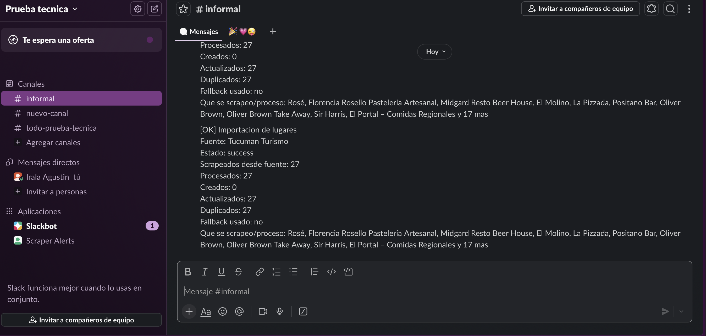
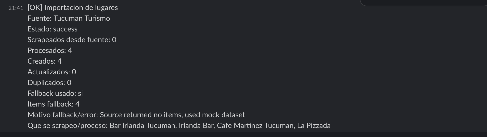
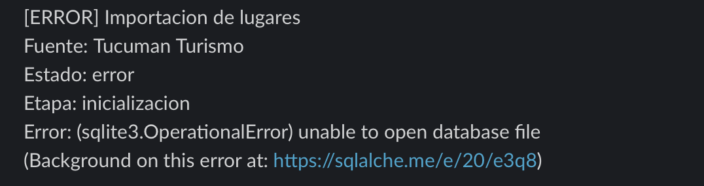
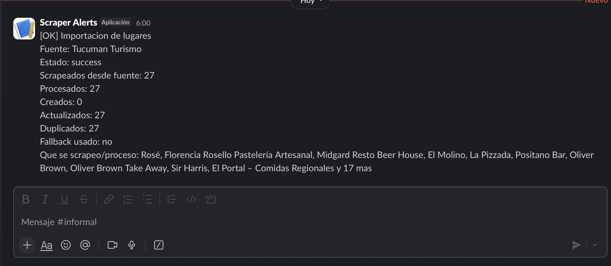
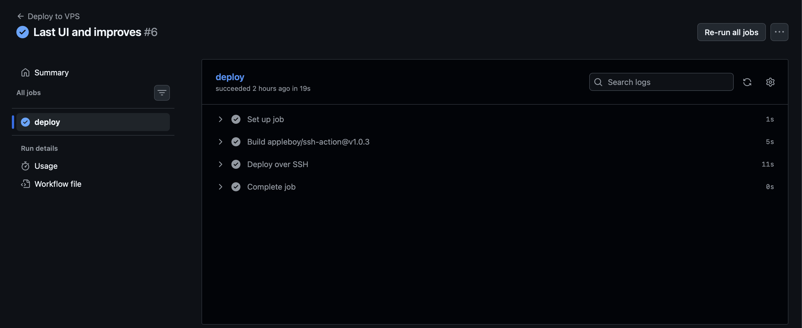
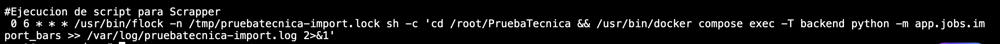

# Tucuman Places Automator

Sistema para scrapear, enriquecer y administrar bares/restaurantes de Tucuman a partir de una fuente publica, con fallback local, logs operativos y despliegue automatizado.

## Stack

- Backend: Python, FastAPI, SQLAlchemy
- Base de datos: SQLite
- Frontend: React, Vite, TypeScript
- IA: OpenAI API con fallback local por reglas
- Notificaciones: Slack Incoming Webhook opcional
- Deploy: Docker Compose + Nginx
- Automatizacion: cron, n8n o endpoint protegido por token

## Funcionalidades

- Scraping no agresivo desde Tucuman Turismo.
- Parser adaptado a la estructura real de la pagina fuente.
- CRUD de lugares.
- Desactivacion logica.
- Clasificacion y descripcion con IA.
- Fallback local si OpenAI no esta configurado o falla.
- Deteccion de duplicados por normalizacion y similitud.
- Logs de importacion, scraping e interaccion con IA.
- Notificacion Slack con resumen de cada corrida.
- Dashboard con metricas y ultimas cargas.

## Variables de entorno

Archivo `.env` en el root del repo:

```env
OPENAI_API_KEY=
SLACK_WEBHOOK_URL=
SLACK_SCRAPE_PREVIEW_LIMIT=10
IMPORT_RUN_TOKEN=
DATABASE_URL=sqlite:///./data/app.db
SOURCE_URL=https://www.tucumanturismo.gob.ar/articulos/articulo/174/bares-y-restaurantes
PUBLIC_API_URL=http://localhost:8000
VITE_API_URL=http://localhost:8000
CORS_ORIGINS=http://localhost:5173,http://127.0.0.1:5173
BACKEND_BIND_HOST=127.0.0.1
BACKEND_HOST_PORT=18000
FRONTEND_BIND_HOST=127.0.0.1
FRONTEND_HOST_PORT=18173
```

## Uso local

Backend:

```bash
cd backend
python -m venv .venv
source .venv/bin/activate
pip install -r requirements.txt
uvicorn app.main:app --reload --port 8000
```

Frontend:

```bash
cd frontend
npm install
npm run dev
```

Import manual:

```bash
cd backend
.venv/bin/python -m app.jobs.import_bars
```

## Logs

El backend deja trazabilidad en stdout para:

- descarga de la fuente
- parseo del scraper
- cantidad de candidatos y resultados
- nombres extraidos
- uso de fallback
- request/response de OpenAI
- resumen final del import

Ejemplo local:

```bash
cd backend
.venv/bin/python -m app.jobs.import_bars
```

## Modulo de IA

El enriquecimiento con IA vive en:

- [backend/app/services/ai.py](/Users/agustinirala/Desktop/runacode/PruebaTecnica/backend/app/services/ai.py:1)

Responsabilidad del modulo:

- clasificar el lugar en una categoria util para el dashboard
- generar una descripcion breve
- evitar que el scraping dependa completamente de OpenAI

Flujo:

1. El scraper obtiene datos crudos de la web publica.
2. El importador manda cada item a `PlaceAI.enrich(...)`.
3. Si existe `OPENAI_API_KEY`, se llama a `gpt-4o-mini`.
4. Si no hay key o la llamada falla, se usa fallback local por reglas.
5. El resultado enriquecido se guarda junto con el registro.

Campos enviados al modelo:

- `name`
- `address`
- `city`
- `services`
- `opening_hours`

Salida esperada del modelo:

- `category`
- `description`

Categorias actualmente soportadas:

- `bar`
- `restaurante`
- `cafe`
- `pizzeria`
- `heladeria`
- `pasteleria`
- `regional`
- `boliche`
- `otro`

Fallback local:

- si detecta `pizza` -> `pizzeria`
- si detecta `helad` -> `heladeria`
- si detecta `cafe` -> `cafe`
- si detecta `pastel` o `panader` -> `pasteleria`
- si detecta `regional` o `empanad` -> `regional`
- si detecta `rest` o `parrilla` -> `restaurante`
- si no encuentra mejor senal -> `bar`

Esto permite defender la decision tecnica:

- la IA agrega valor
- pero no es un punto unico de falla
- el sistema sigue operando sin credenciales externas

## Como probar la IA y sus logs

Para ver los logs del modulo de IA en local:

1. configurar `OPENAI_API_KEY` en el `.env`
2. correr una importacion manual

```bash
cd backend
.venv/bin/python -m app.jobs.import_bars
```

Vas a ver logs como:

- `AI request name=... payload=...`
- `AI response name=... raw=...`
- `AI enrichment applied name=... result=...`

Para probar el fallback:

1. vaciar `OPENAI_API_KEY` en `.env`
2. volver a correr el import

```bash
cd backend
.venv/bin/python -m app.jobs.import_bars
```

En ese caso deberias ver:

- `AI disabled, using fallback name=...`
- `AI fallback result name=... result=...`

Si queres probarlo desde la UI:

1. levantar backend y frontend
2. cargar el token de importacion
3. ejecutar `Importar datos`
4. mirar la consola donde corre `uvicorn`


## Seguridad operativa

- `POST /imports/run` esta protegido con `Authorization: Bearer $IMPORT_RUN_TOKEN`.
- La UI pide el token para disparar una importacion manual.
- El frontend no embebe el token en el bundle.
- Los servicios Docker se publican por `127.0.0.1` para usarlos detras de Nginx.

## Uso con Docker

```bash
docker compose up -d --build
```

Servicios internos por defecto:

- Backend: `127.0.0.1:18000`
- Frontend: `127.0.0.1:18173`

Import manual dentro del stack:

```bash
docker compose exec backend python -m app.jobs.import_bars
```

## Deploy en VPS

El proyecto esta preparado para convivir con otras apps en la misma VPS.

Supuesto recomendado:

- backend en `127.0.0.1:18000`
- frontend en `127.0.0.1:18173`
- Nginx como reverse proxy

Deploy:

```bash
cd /root/PruebaTecnica
docker compose up -d --build
```

## Nginx

Ejemplo:

```nginx
server {
    listen 80;
    listen [::]:80;
    server_name pruebaapp.la-curva.com;

    location / {
        proxy_pass http://127.0.0.1:18173;
        proxy_http_version 1.1;
        proxy_set_header Host $host;
        proxy_set_header X-Real-IP $remote_addr;
        proxy_set_header X-Forwarded-For $proxy_add_x_forwarded_for;
        proxy_set_header X-Forwarded-Proto $scheme;
    }
}

server {
    listen 80;
    listen [::]:80;
    server_name pruebaapi.la-curva.com;

    location / {
        proxy_pass http://127.0.0.1:18000;
        proxy_http_version 1.1;
        proxy_set_header Host $host;
        proxy_set_header X-Real-IP $remote_addr;
        proxy_set_header X-Forwarded-For $proxy_add_x_forwarded_for;
        proxy_set_header X-Forwarded-Proto $scheme;
    }
}
```

Chequeos:

```bash
sudo nginx -t
sudo systemctl reload nginx
curl http://127.0.0.1:18000/health
```

## Cron

Cron diario configurado sugerido:

```cron
0 6 * * * /usr/bin/flock -n /tmp/pruebatecnica-import.lock sh -c 'cd /root/PruebaTecnica && /usr/bin/docker compose exec -T backend python -m app.jobs.import_bars >> /var/log/pruebatecnica-import.log 2>&1'
```

## Slack

Si `SLACK_WEBHOOK_URL` esta configurado, cada importacion envia:

- estado
- scrapeados desde fuente
- procesados
- creados
- actualizados
- duplicados
- si uso fallback
- una muestra de nombres scrapeados

## GitHub Actions

Workflow incluido:

- [.github/workflows/deploy.yml](/Users/agustinirala/Desktop/runacode/PruebaTecnica/.github/workflows/deploy.yml:1)

Dispara deploy automatico a la VPS en cada push a `main`.

Environment esperado en GitHub:

- `production`

Secrets requeridos:

```env
VPS_HOST=
VPS_USERNAME=
VPS_PORT=22
VPS_SSH_KEY=
VPS_APP_DIR=/root/PruebaTecnica
```

El workflow ejecuta:

```bash
cd /root/PruebaTecnica
git fetch --all --prune
git reset --hard origin/main
docker compose up -d --build
docker image prune -f
```

## Evidencia


### Dashboard con datos importados


### Slack - importacion exitosa



### Slack - importacion con fallback



### Slack - importacion con error




### Slack - cronjob 



Se ve el horario a las 6:00 como se programa en el cronjob del servidor

### GitHub Actions - deploy exitoso



### Cron configurado en VPS




## n8n

Alternativa de automatizacion:

1. Cron Trigger
2. SSH a la VPS
3. `cd /root/PruebaTecnica && docker compose exec -T backend python -m app.jobs.import_bars`
4. leer salida
5. enviar notificacion

Referencia:

- [deploy/n8n-flow-notes.md](/Users/agustinirala/Desktop/runacode/PruebaTecnica/deploy/n8n-flow-notes.md:1)

## Deteccion de duplicados

1. Normalizacion de nombre y direccion.
2. Comparacion exacta por clave normalizada.
3. Comparacion por similitud.
4. Si parece duplicado, se actualiza el registro existente.

## Limitaciones

- La fuente puede cambiar su HTML.
- SQLite sirve para prueba tecnica y despliegue simple, no para alta concurrencia.
- El endpoint de importacion esta protegido por token, no por un sistema completo de autenticacion.
- El parser esta ajustado a la fuente actual; si cambia mucho, hay que revisarlo.

## Mejoras futuras

- PostgreSQL
- autenticacion real
- multiples fuentes
- historial de cambios
- aprobacion manual
- export CSV/JSON
- smoke tests post deploy
